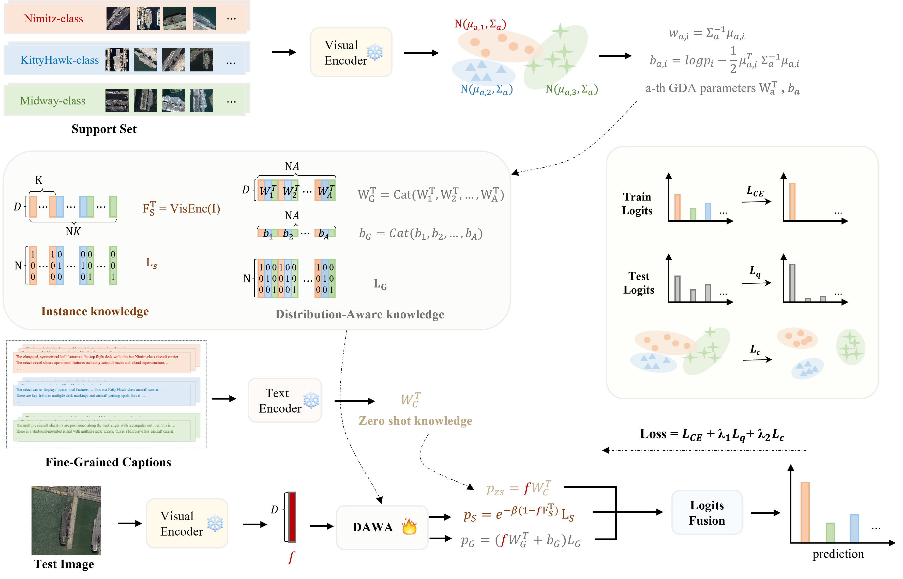

# Distribution-Aware CLIP-Adapter with Fine-Grained Text for Few-Shot Fine-Grained Classification
Official implementation of 'Distribution-Aware CLIP-Adapter with Fine-Grained Text for Few-Shot Fine-Grained Classification'


## Introduction

DAWA first obtains zero-shot knowledge via the similarity between test image features and fine-grained captions, then fuses this zero-shot knowledge with two types of knowledge generated from the support set. The instance knowledge that comes from the visual features of samples extracted by CLIP’s visual encoder, and the Distribution-Aware knowledge which is derived from the statistical distribution of visual features modeled via Gaussian Discriminant Analysis.  

<div align="center">
  
</div>


## Requirements
### Installation
Create a conda environment and install dependencies:
```bash
git clone https://github.com/JingMing77/dawa-clip.git
cd dawa-clip

conda create -n dawa python=3.7
conda activate dawa

pip install -r requirements.txt

# Install the according versions of torch and torchvision
conda install pytorch torchvision cudatoolkit
```

### Dataset
```bash
  ├─CLASS 1
    ├───1.png
    ├───2.png
    ├───...
  ├─CLASS 2
    ├───1.png
    ├───2.png
    ├───...
  ├─...
```

## Get Started
### Configs
The running configurations can be modified in `configs/dataset.yaml`, including shot numbers, visual encoders, and hyperparamters. 

You can edit the `search_scale`, `search_step`, `init_beta` and `init_alpha` for fine tuning.

Note that the default `load_cache` and `load_pre_feat` are `False` for the first running, which will store the cache model and val/test features in `configs/dataset/`. For later running, they can be set as `True` for faster hyperparamters tuning.


### Running
```bash
python main.py --config configs/dataset.yaml
```


## Acknowledgement
This repo benefits from [CLIP](https://github.com/openai/CLIP), [CoOp](https://github.com/KaiyangZhou/Dassl.pytorch) and [Tip-Adapter](https://github.com/gaopengcuhk/Tip-Adapter). Thanks for their wonderful works.

## Citation
```bash

```

